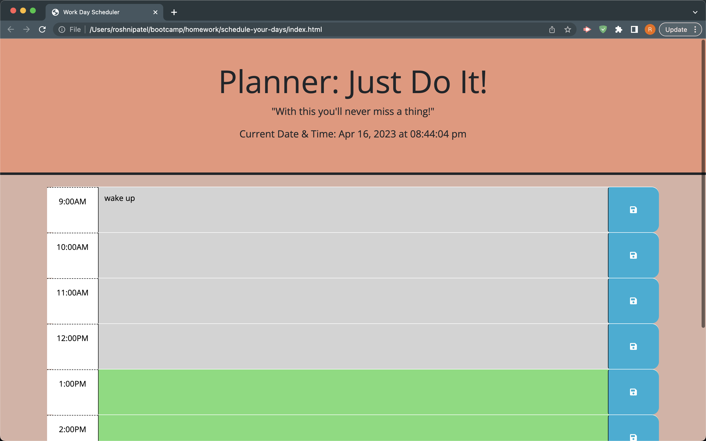

# Schedule Your Days!

## Description

I have created this scheduler to help someone in need to never ever be late to anything as many of us find ourselves in the situation. It uses mostly JavaScript along with HTML and CSS as well as bootstrap, google fonts, and api's.

## Usage 

The only thing you have to do is click on the link below and it will take you to my scheduler where you can type in a to-do at your preferred time and it will save it to local storage and will stay on the screen even after refreshing the page. The colors describe if the task has passed (grey), currently occurring (red), or coming up (green). 

## Links

Repository: https://github.com/roshniipatel

Github Page: https://roshniipatel.github.io/schedule-your-days/ 

## Acknowledgements 

w3schools https://www.w3schools.com/

MDN Webdocs https://developer.mozilla.org/en-US/

Youtube videos

Tutors
